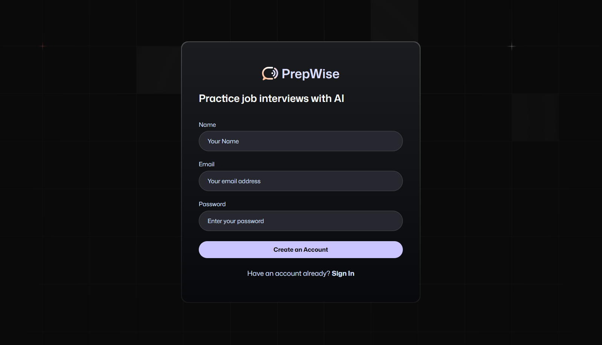

# PrepWise

<div align="center">
  
</div>

A job interview preparation platform powered by AI voice agents. Build mock interviews, get instant feedback, and track your progress—all in one place.

## ⚙️ Tech Stack

- Next.js
- Firebase
- Tailwind CSS
- AI Voice Agents (Vapi / Google Gemini)
- Zod for validation

## 🔋 Features

- **Authentication:** Sign up / Sign in with Firebase.
- **Create Interviews:** Generate AI-assisted mock interviews.
- **Feedback:** Get detailed feedback from AI based on your responses.
- **Dashboard:** Track all interviews with easy navigation.
- **Responsive Design:** Works on desktop and mobile.

## 🤸 Quick Start

1. Clone the repo:

```bash
git clone https://github.com/Sachinbhanu7/PrepWise.git
cd PrepWise
Install dependencies:

bash
Copy code
npm install
Create .env.local and add your Firebase / AI keys.

Run locally:

bash
Copy code
npm run dev
Open http://localhost:3000 in your browser.

🚀 License
This project is for personal learning and portfolio purposes.


